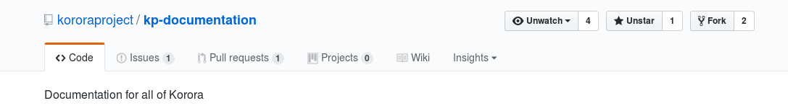

# Contribution Guidelines

**Guidlines for those that wish to contribute to the docs to be created.**

> We welcome all contributions to the Korora Documentation but please follow these guidlines.

## How To Contribute

If you wish to contribute to the Korora Docs, first you must create a GitHub account if you have not already done so.

You must then  fork the repo ( you will find the button at the top of the page).

You must then submit a pull request for any new documentation you may add, which will then be subject to review before inclusion.

## File Heirachy

### GettingKorora
This folder includes installation, creating bootable media, choosing a desktop Etc.

### UsingKorora
This folder includes genral use, desktop specific guides, upgrading / updating, GRUB, Bootloader Etc

### GettingHelp
This folder includes how to get support, using Engage Etc

## File Naming Conventions
When adding new files, please follow the following file naming guidlines:
1. File name must relate to the topic
2. Must be in English and start with a capital letter
3. All files must be in markdown format (`.md`)
4. If using multiple words in the file name, use CamleCase and seperate each word with a hyphen (eg: `Using-Korora.md`)

## Image Naming Conventions
All images are to be placed in the `img `folder.

When naming your images please name them using the name of your file and if multiple images, further name them with a number or heading for which they are under, for example: `Contibution-Guidelines-Fork.png`.
