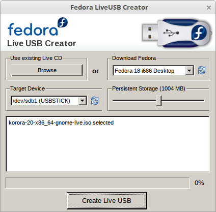
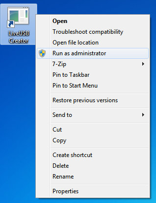
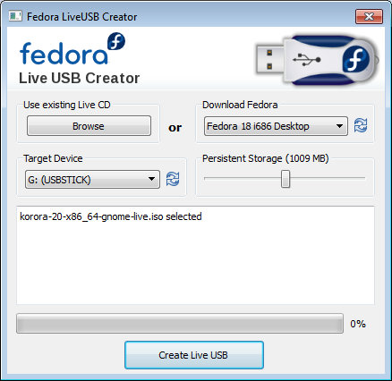

# Creating bootable media

Your Korora image is a live system meaning it's a complete operating system, designed to be booted directly from a USB memory stick. It does not write to your hard disk unless you run the installer, after which time you can boot Korora directly from your computer in non-live mode.


> The Korora images optionally support persistence mode, where you can use a part of your USB stick to seamlessly store any changes that you make during the live session. The next time you boot your live media those changes will persist. This mode is only supported when using the Fedora tools for creating the media, however, and is not needed for a regular install of Korora.


This document assumes that you have already [downloaded](https://kororaproject.org/download) the Korora image for the desktop and architecture you want.

The Korora images are all named in a similar manner and include the version, architecture and desktop. In our examples below we will be using korora-20-x86_64-gnome-live.iso which is the 64 bit Korora 20 GNOME image that we have saved in the Downloads directory in our home. Substitute this accordingly with the version you have downloaded and its location.


> Hint: Because most operating systems implement some sort of caching when writing to USB, it's a good idea to use a stick that has a light to indicate when writes are occurring. This makes it much easier to know when it's OK to unplug the drive.

> We highly recommend that you test the media on your first boot by selecting the Test this media and boot Korora option from the Troubleshooting menu (already the default on EFI systems). This will help to catch any problems due to corrupt download or incomplete write to USB.


## Create USB media on Linux

There are a number of generic tools such as [UNetbootin](http://unetbootin.sourceforge.net/), however these are known to sometimes fail with Fedora. Our recommended method for creating USB media is to use the [Fedora Live USB Creator](https://fedorahosted.org/liveusb-creator/) tool, however it may not be available for your distribution. If not, the only reliable method is to use the _dd_ tool (or a derived program).

### Fedora Live USB Creator

To use Fedora Live USB Creator you must have a FAT32 formatted USB stick of greater size than the ISO image you want to write. Plug this in first and ensure it's available (in our example it's called USBSTICK at /dev/sdb1).

If you're already running Fedora you can install Live USB Creator via the terminal as root, or the software manager.

```
yum install liveusb-creator
```

Once it is installed, you should be able to start it like any other program. It requires elevated privileges and will prompt for your root password.

Under _Use existing Live CD_, click the Browse button and select the Korora ISO from wherever you downloaded it to (such as your Downloads directory).

Ensure that your FAT32 formatted USB stick is detected under _Target Device_.

> Any data on the device specified here will be destroyed. Please ensure it is the correct device.

If you want to enable persistence whilst running in live mode, then set how much space you want under Persistent Storage (this is in addition to the space required for the ISO image).

The screen should look something like this.



Now hit the Create Live USB button to begin. The log will tell you when it has been completed, and should look something like this.

```
korora-20-x86_64-gnome-live.iso selected
Verifying filesystem...
Setting /dev/sdb1 label to LIVE
Verifying ISO MD5 checksum
ISO MD5 checksum passed
Extracting live image to USB device...
Wrote to device at 3 MB/sec
Creating 1004MB persistent overlay
Setting up OLPC boot file...
Installing bootloader...
Unmounting /run/media/chris/USBSTICK
Complete! (0:14:20)
```

Now that USB stick is ready to boot Korora!

### The dd command

Using the dd command is the single most reliable method of creating the USB media, as it writes the exact ISO image to the USB stick, overwriting any existing partitions and data. It does not support persistence mode, however.

> When using dd you really need to know which device your USB stick is as you don't want to overwrite the wrong drive!

Unlike the Fedora LiveUSB Creator tool which writes to a FAT32 partition on your USB stick (such as /dev/sdb1), dd must write to the root device (such as /dev/sdb) or it will fail to boot. The root device will **never **be followed by a number because a number indicates a partition.

This is a device (and what you would write to).

**/dev/sdb**

This is a partition on the device (and **not** what you would write to).

**/dev/sdb1**

You can usually find out your USB stick device on Linux by running the _dmesg_ command after plugging it in and seeing what device was detected. If that doesn't help, then in most cases the stick will also pop up and ask to be mounted as it will already have a file system on it. If you mount it you can then run the _df -h_ command to see which device was mounted.

Again, please use the device itself, not a partition on the device.

When using dd you must specify the following.

  - Input file, denoted by _if_ which is your ISO image

- Output file, denoted by _of_ which is your USB stick device

Using the example below, replace the path to the ISO image with the location you downloaded it to (where we've used _~/Downloads/korora-20-x86_64-gnome-live.iso_). Also change the device (where we've used sdx) to be your suitably sized (2GB+) USB stick device.

> Please be aware that this action will wipe the entire contents of the USB stick! Ensure you back up anything you want to keep on it and don't specify the wrong device.

<br />
> The dd command will take a long time, please do not unplug your USB stick until the command has finished on its own.


The command must be run as root, or via a command like sudo.

```
dd if=~/Downloads/korora-20-x86_64-gnome-live.iso of=/dev/sdx bs=4M
```

It may be a good idea to run the sync command to flush any writes.

```
sync
```

Make sure that the USB stick has finished writing before you unplug it and it should now be ready to boot Korora!

## Create USB media on Windows

Windows users can download and install the LiveUSB creator tool to easily make the bootable USB stick. Download (from that site only) and install the software onto your computer.

To use Fedora Live USB Creator you must have a FAT32 formatted USB stick of greater size than the ISO image you want to write. Plug this in first and ensure it's available (in our example it's called _USBSTICK_ at G:).

Live USB Creator needs to be run as an administrator, so right click on the icon and select _Run as administrator_, then agree when prompted.



Under _Use existing Live CD_, click the Browse button and select the Korora ISO from wherever you downloaded it to (such as your _Downloads_ directory in your home drive).

Ensure your FAT32 formatted USB stick is detected under _Target Device_.

If you want to enable persistence whilst running in live mode, then set how much space you want under _Persistent Storage_ (this is on top of the size required for the ISO image).

The screen should look something like this.



Now hit the _Create Live USB_ button to begin. The log will tell you when it has been completed, and should look something like this.

```
korora-20-x86_64-gnome-live.iso selected
Verifying filesystem...
Extracting live image to USB device...
Wrote to device at 3 MB/sec
Creating 1009MB persistent overlay
Setting up OLPC boot file...
Installing bootloader...
Complete! (0:14:20)
```

Now that USB stick is ready to boot Korora!

## Create USB media on OS X (and maybe Unix)
There is no approved tool for other Unix operating systems such as OS X, so you must use the dd command. When using the dd tool, it will wipe the entire USB stick, so it doesn't matter what partition or file system it already has on there. Also, dd must write to the root device **not** a partition on the device.

After you have plugged in your USB stick you can find out what device it is by using the _disk utility_ or running the diskutil list command. It should be something like _/dev/disk1_.

If it has a partition then the device will be something like /dev/disk1s1 and should be unmounted before running the dd command.

```
diskutil unmountDisk /dev/disk1
```

When running dd, please remember that you need to write to the device, not the partition.

This is a device (and what you would write to).

**/dev/disk1**

This is a partition on the device (and **not** what you would write to).

**/dev/disk1s1**

When using dd you must specify the following.

- Input file, denoted by _if_ which is your ISO image

- Output file, denoted by _of_ which is your USB stick device

Using the example below, replace the path to the ISO image with the location you downloaded it to (where we've used _~/Downloads/korora-20-x86_64-gnome-live.iso_). Also change the device (where we've used _disk1_) to be your suitably sized (2GB+) USB stick _device_.

> Please be aware that this action will wipe the entire contents of the USB stick! Ensure you back up anything you want to keep on it and don't specify the wrong device.

<br />

>The dd command will take a long time, please do not unplug your USB stick until the command has finished on its own.

The command must be run as root, or via a command like sudo.

```
dd if=~/Downloads/korora-20-x86_64-gnome-live.iso of=/dev/disk1 bs=4M
```

It may be a good idea to run the sync command to flush any writes.

```
sync
```

Make sure that the USB stick has finished writing before you unplug it and it should now be ready to boot Korora!
